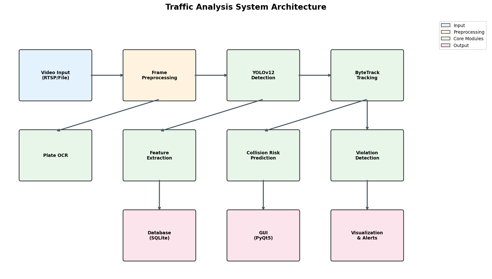
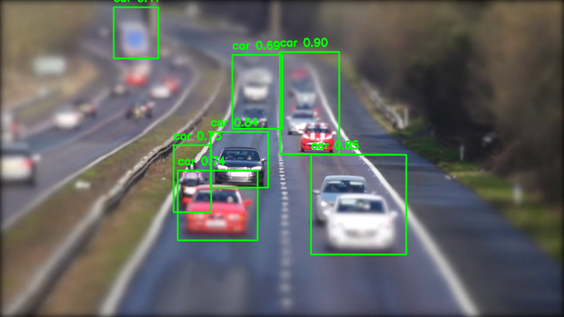
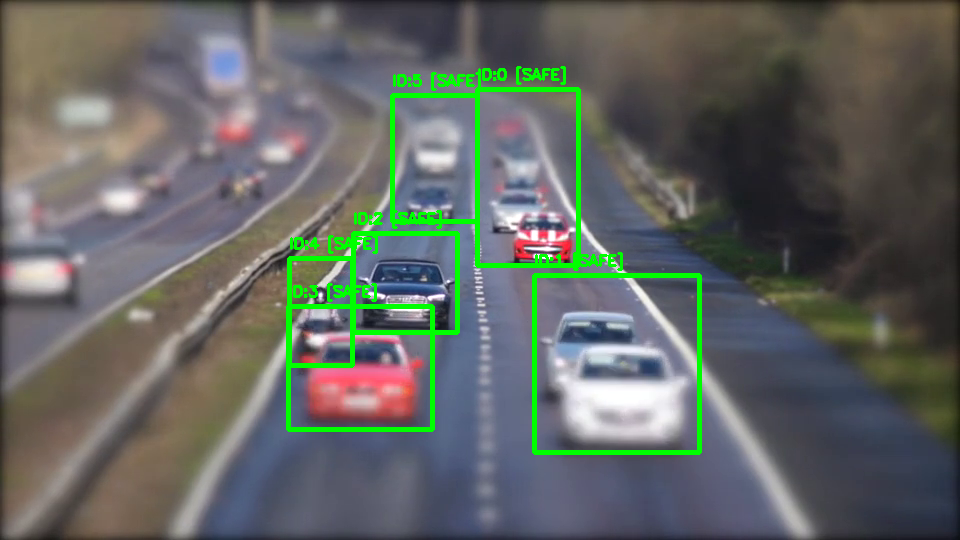

# Traffic Analysis System - Mid-term Progress Report

## PPT Structure Guide

This document provides the content outline for the mid-term progress review presentation.

---

## Slide 1: Cover Page

```
Traffic Analysis System
Mid-project Progress Review

Instructor: Andy Wu

Group Members:
  Shang Lou    24262423
  Xiang Chen   24260426
  Zhikai Wang  24260679
  Xu Wang      24261906

Date: 2026-01-XX
```

---

## Slide 2: Outline

1. Brief Introduction
2. Mid-term Progress Review
   - Vehicle Detection (YOLOv12)
   - Multi-Object Tracking (ByteTrack)
   - Collision Risk Prediction
   - Adaptive Violation Detection
   - License Plate OCR
   - GUI Interface
3. Problems & Solutions
4. Next Steps

---

## Slide 3: Introduction

### Project Overview
- Real-time Traffic Analysis System based on YOLOv12 + ByteTrack
- Core Features:
  - Vehicle Detection & Classification
  - Multi-Object Tracking
  - Collision Risk Prediction
  - Intelligent Violation Detection
  - License Plate Recognition

### Tech Stack
| Category | Technology |
|----------|------------|
| Deep Learning | PyTorch, YOLOv12 (Ultralytics) |
| Object Tracking | ByteTrack |
| Trajectory Prediction | LSTM |
| GUI | PyQt5 |
| Database | SQLite |

---

## Slide 4: System Architecture



```
Video Input → Frame Preprocessing → YOLOv12 Detection → ByteTrack Tracking
                                                              ↓
                        ← Visualization ← Risk Assessment ← Feature Analysis
```

---

## Slide 5: Mid-term Progress Overview

| Module | Status | Completion |
|--------|--------|------------|
| Vehicle Detection (YOLOv12) | Completed | 100% |
| Multi-Object Tracking (ByteTrack) | Completed | 100% |
| Collision Risk Prediction | Completed | 100% |
| Adaptive Violation Detection | Completed | 100% |
| License Plate OCR | Completed | 100% |
| GUI Interface | Completed | 100% |
| Performance Optimization | In Progress | 80% |

---

## Slides 6-7: Vehicle Detection Module

### Technical Details
- **Model**: YOLOv12n (Ultralytics)
- **Training Data**: UA-DETRAC Dataset
- **Detection Classes**: car, bus, truck, motorcycle, bike
- **Confidence Threshold**: 0.2 (optimized for ByteTrack two-stage matching)
- **IOU Threshold**: 0.45

### Key Code
```python
from src.core import VehicleDetector

detector = VehicleDetector(
    model_path='models/yolo12n_vehicle.pt',
    confidence=0.2,
    device='cuda'
)
detections = detector.detect_vehicles(frame)
```

### Screenshot


---

## Slides 8-9: Multi-Object Tracking Module

### Technical Details
- **Algorithm**: ByteTrack
- **Core Mechanism**: Two-stage matching
  - Stage 1: High-confidence detections (≥0.5) match with tracks
  - Stage 2: Low-confidence detections (0.2-0.5) recover lost tracks
- **Parameters**:
  - track_thresh: 0.5
  - track_buffer: 30 frames
  - match_thresh: 0.8

### Key Innovation
- Lowered detection confidence to 0.2 enables ByteTrack's low-confidence recovery
- Reduces missed detections and ID switches

### Screenshot


---

## Slides 10-11: Collision Risk Prediction

### Technical Details
- **Trajectory Prediction**: LSTM model predicts future 15 frames
- **Risk Calculation**: Time-To-Collision (TTC) analysis
- **Following Distance**: Detects unsafe distances between same-direction vehicles

### Risk Levels
| Color | Level | Description |
|-------|-------|-------------|
| Green | SAFE | No risk |
| Yellow | LOW | Close following distance |
| Orange | MEDIUM | Moderate risk |
| Red | HIGH | High risk |
| Purple | CRITICAL | Imminent collision |

### Screenshot


---

## Slides 12-13: Adaptive Violation Detection (Innovation)

### Technical Details
- **Violation Types**: Red light running, Speeding
- **Smart Anomaly Detection**:
  - Detects emergency vehicles (ambulance, fire truck, police car)
  - Detects traffic police directing traffic
  - Marks special situations as "anomaly" for manual review

### Anomaly Handling
| Situation | Handling | Snapshot Location |
|-----------|----------|-------------------|
| Normal Violation | Record | `snapshots/violations/` |
| Emergency Vehicle Nearby | Mark as Anomaly | `snapshots/anomaly/` |
| Traffic Police Nearby | Mark as Anomaly | `snapshots/anomaly/` |

### Screenshot


---

## Slide 14: License Plate OCR

### Technical Details
- **Model**: CRNN (Convolutional Recurrent Neural Network)
- **Supported Format**: Chinese license plates
- **Pipeline**: Plate Detection → Character Segmentation → Recognition

### Screenshot


---

## Slide 15: GUI Interface

### Features
- Real-time video monitoring
- Statistics dashboard (traffic flow, violation distribution)
- Violation records table
- Search by license plate
- Configuration panel

### Screenshot


---

## Slide 16: Problems & Solutions

| Problem | Root Cause | Solution |
|---------|------------|----------|
| Missed detections & overlapping boxes | Confidence threshold (0.5) too high, disabling ByteTrack's low-confidence recovery | Lowered confidence to 0.2 |
| IndexError in tracker | Loop modified list while iterating | Removed unnecessary list modification |
| GUI attribute mismatch | ViolationRecord used `is_anomaly` but GUI used `is_exempted` | Updated GUI to use correct attribute names |
| GUI spinbox override | Spinbox initialized to 50% overriding 0.2 default | Changed spinbox initial value to 20% |

---

## Slide 17: Next Steps

1. **Performance Optimization**
   - Target: ≥15 FPS on GPU
   - Optimize inference pipeline

2. **Additional Violation Types**
   - Wrong-way driving detection
   - Illegal lane change detection

3. **Deployment & Testing**
   - Docker containerization (completed)
   - Real-world testing with traffic cameras

4. **Documentation**
   - User manual
   - API documentation

---

## Slide 18: Ending

```
THANKS FOR LISTENING

Traffic Analysis System
Mid-project Progress Review

Instructor: Andy Wu
Group Members:
  Shang Lou, Xiang Chen, Zhikai Wang, Xu Wang

Date: 2026-01-XX
GitHub: https://github.com/Zhye26/yolo_ls
```

---

## Screenshots Directory

All screenshots are stored in `screenshots/` folder:
- `architecture.png` - System architecture diagram
- `detection.png` - Vehicle detection results
- `tracking.png` - Multi-object tracking with IDs
- `collision_risk.png` - Collision risk visualization
- `violation.png` - Violation detection results
- `plate_ocr.png` - License plate recognition
- `gui.png` - GUI interface overview
